# PaySaSuchan — Product Guide (Plain Language)

> **Who is this for?** Business owners, investors, support staff, and anyone who wants to understand what PaySaSuchan does — without technical jargon.  
> **Last updated:** September 2026

---

## What is PaySaSuchan?

**PaySaSuchan** is a personal and shared money management app. It helps people:

- Track **what they spend** and **what they earn**
- Split bills with **friends, roommates, or family**
- Get **reminders** for upcoming payments
- See **reports** and simple insights about their money
- Ask an **AI assistant** questions about their finances

Think of it as a digital notebook for your money — but smarter, shared, and available on **phone** and **computer**.

---

## Two types of users

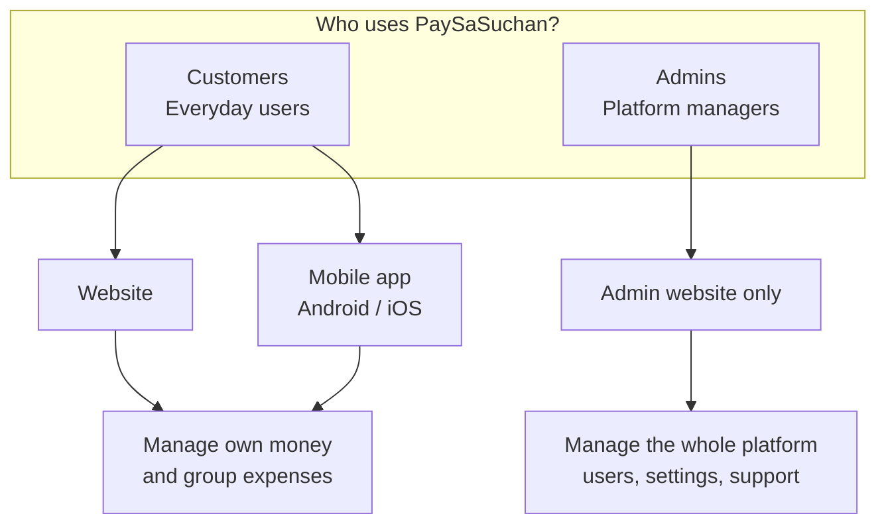

| User type | Who they are | Where they log in |
|-----------|--------------|-------------------|
| **Customer** | Anyone tracking personal or shared expenses | Website or mobile app |
| **Admin** | Your team running the platform | Admin website only |

---

## How customers get started

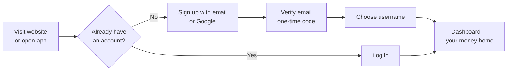

**In simple terms:**

1. **Sign up** with email (you get a code to verify) or **Continue with Google**
2. Pick a **username** — friends can use this to invite you to groups
3. Land on your **Dashboard** — a snapshot of this month’s money

**On mobile:** You can log in the same way. Full sign-up and password reset are easiest on the website today.

---

## Customer features — explained one by one

### 1. Dashboard — your money at a glance

**What you see:** A home screen for the current month.

| What it shows | Why it helps |
|---------------|--------------|
| Total spent & total income | Quick answer: “Am I ahead or behind this month?” |
| Daily spending chart | Spot heavy spending days |
| Recent transactions | Last few expenses and income entries |
| AI insight card | A short, friendly tip about your spending |
| Upcoming reminders | Bills or payments you asked to be reminded about |

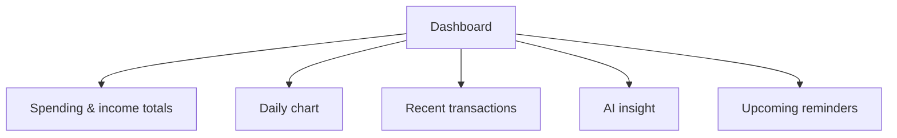

**Available on:** Website and mobile app

---

### 2. Transactions — record every expense and income

**What it is:** Your main list of money in and money out.

**You can:**

- **Add an expense** — e.g. “₹500 lunch”, “₹2,000 groceries”
- **Add income** — e.g. “Salary ₹50,000”, “Freelance ₹5,000”
- **Edit or delete** something you entered wrong
- **Search and filter** by date, category, or type
- **Attach a photo or PDF** of a bill or receipt
- **Scan a receipt with AI** (website) — the app reads the amount and details for you
- **Import many rows from a spreadsheet** (website) — useful when moving from Excel
- **Share a receipt link** — send a view-only link to someone else
- **Mark recurring bills** — e.g. rent every month; approve when they repeat

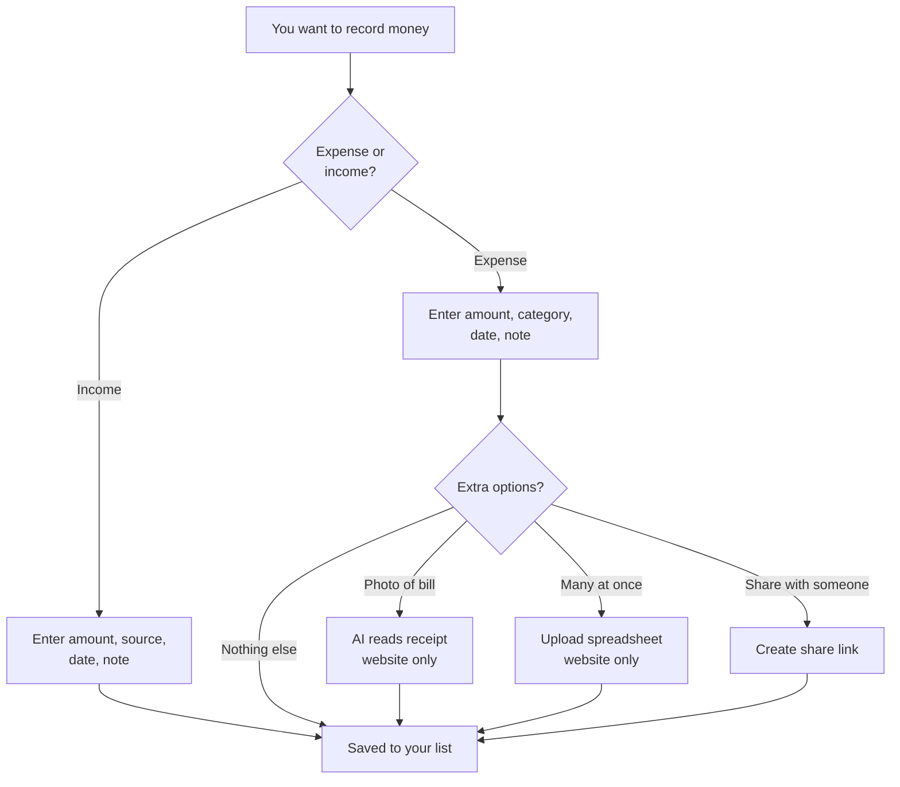

**Categories** help you group spending — Food, Transport, Rent, etc.  
**Payment type** records how you paid — Cash, UPI, Card, etc.

**Available on:** Website (full) · Mobile (most features; no receipt AI scan or spreadsheet import)

---

### 3. Groups — split expenses with others

**What it is:** A shared space for roommates, trips, families, or any group that shares costs.

**Example:** Four friends go to dinner. One person pays ₹2,000. The app splits it so everyone knows who owes whom.

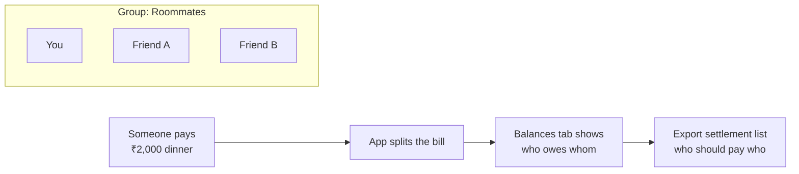

**What you can do:**

| Action | Explanation |
|--------|-------------|
| **Create a group** | e.g. “Flat 402”, “Goa Trip 2026” |
| **Invite members** | By username, email, or phone number |
| **Add a group expense** | Who paid, how to split |
| **Choose split style** | Everyone pays equal · Custom amounts · Custom percentages · Someone excluded |
| **See balances** | Who owes money to whom |
| **Download settlement summary** | A simple list for paying each other back (website) |
| **Group reminders** | Remind the group about shared bills |
| **Move a transaction** | Turn a personal expense into a group one (website), or the other way around |

**Roles:**

- **Admin** — can invite/remove people and manage group settings  
- **Member** — can add expenses and view balances  

**Available on:** Website and mobile app (settlement download is website only)

---

### 4. Reminders — don’t forget to pay

**What it is:** Alarms for bills and payments — for you alone or for a whole group.

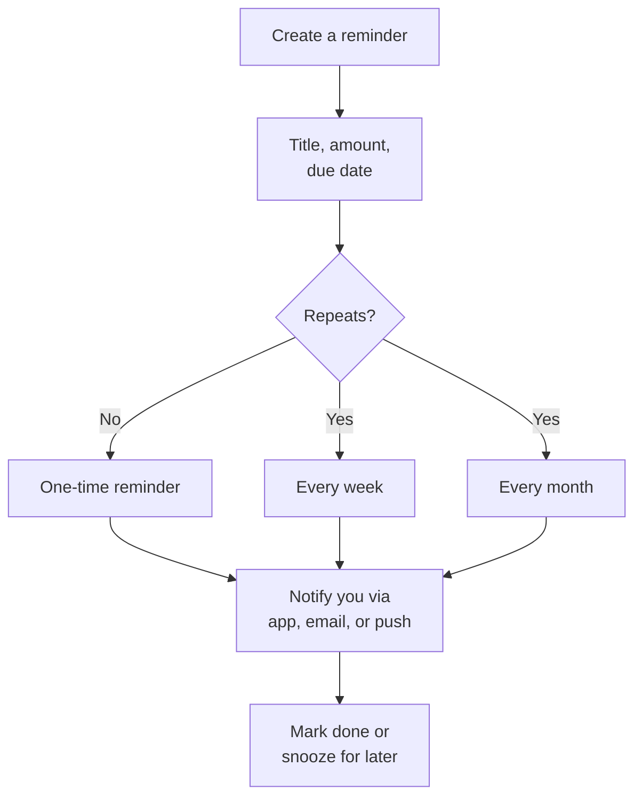

**Examples:**

- “Pay electricity bill — ₹1,200 — 5th of every month”
- “Collect ₹500 from Rahul for cab — this Friday”

**You can:** snooze, complete, or cancel a reminder.

**Available on:** Website and mobile app

---

### 5. Notifications — stay in the loop

**What it is:** A bell icon with messages about your account — group activity, reminders, and updates.

**You control:**

- Turn **in-app** notifications on or off  
- Turn **email** notifications on or off  
- Turn **push** notifications on or off (website browser; mobile push coming later)

**Available on:** Website (full push on browser) · Mobile (in-app list; push limited)

---

### 6. Reports — understand your spending

**What it is:** A filtered view of your money over a period you choose.

**You can:**

- Pick a **date range**
- Filter by **category** (e.g. only Food)
- Filter by **expenses only** or **income only**
- See **totals and breakdowns**
- **Download as a spreadsheet** (website) or **share** (mobile)

**Available on:** Website and mobile app

---

### 7. AI Assistant — ask questions in plain English

**What it is:** A chat helper that knows *your* transaction data (not the whole internet).

**Example questions:**

- “How much did I spend on food this month?”
- “What was my biggest expense last week?”
- “Am I spending more than last month?”

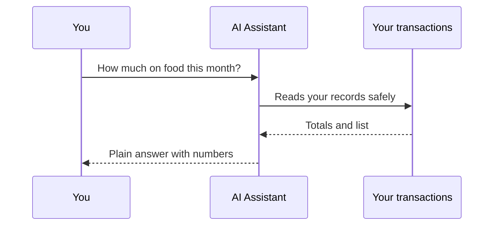

**Also on Dashboard:** A small **insight card** with one automatic tip per visit.

**Receipt scan (website):** Take a photo of a bill; AI fills in amount and details for you to confirm.

**Available on:** Website (chat + insights + receipt scan) · Mobile (chat + insights)

---

### 8. Plans & billing — free trial and paid options

> **Note for operators:** Admins can turn the entire pricing system **off**. When off, everyone gets full access and no prices are shown anywhere.

**Three levels for customers (when pricing is on):**

| Plan | Price (before tax) | Best for |
|------|-------------------|----------|
| **Free trial** | ₹0 for 7 days | Trying the app with limits |
| **Starter** | ₹100/month or ₹1,000/year | Regular users who want no limits |
| **Pro** | ₹10,000 one-time | Lifetime full access |

**Free trial limits (examples):**

- Up to 50 personal transactions  
- Up to 2 groups, 8 people per group  
- Limited AI messages and receipt scans  

**After trial ends without upgrading:** You can still *view* your data, but you cannot add or edit until you upgrade.

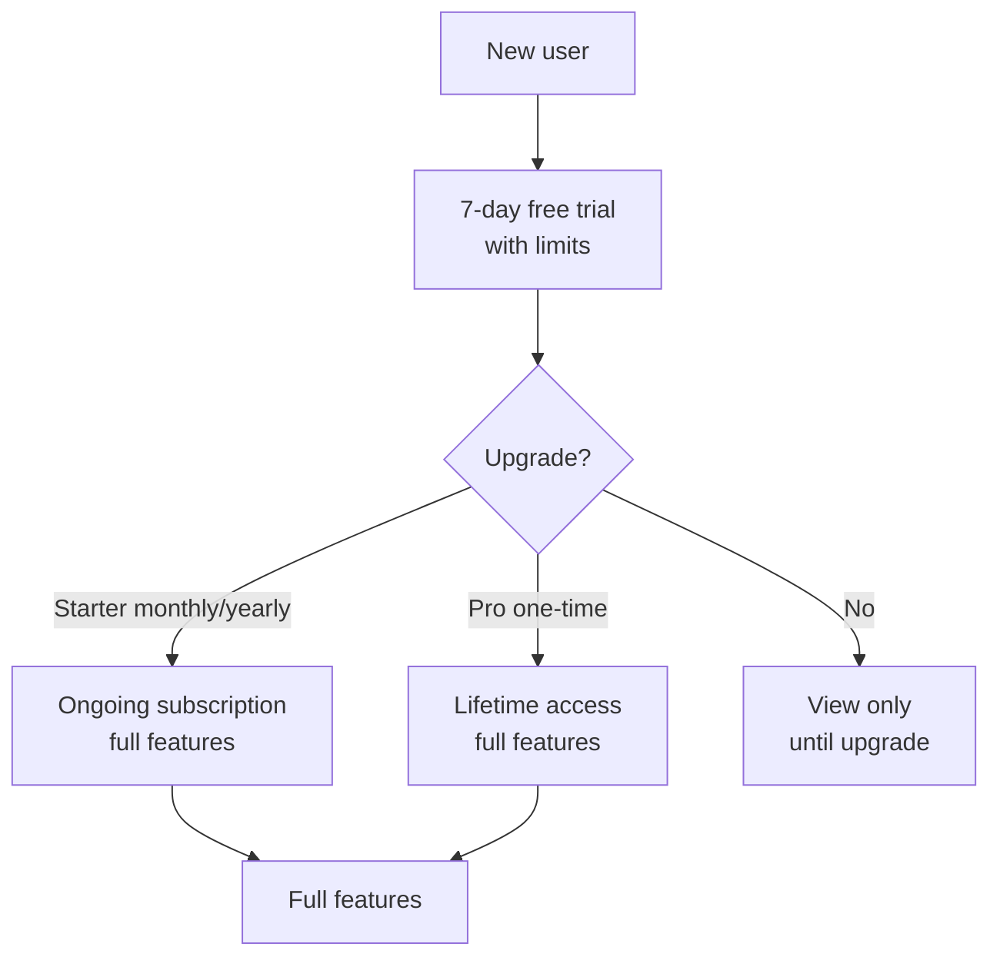

**Paying:**

- Choose a plan in **Settings**
- Pay with **Razorpay** or **Stripe** (which one is active is an admin choice)
- Get a **GST invoice** by email (if email is set up on the platform)
- Save your **GSTIN** on your profile for invoices

**Available on:** Website (full checkout) · Mobile (view plan; pay on website for some payment methods)

---

### 9. Settings & profile

**What you can change:**

- Name, photo, country, currency  
- Password  
- Notification preferences  
- Billing plan, GSTIN, cancel subscription  
- See usage meters during free trial  

**Available on:** Website and mobile app

---

### 10. Help & support

**What it is:** FAQs and a form to contact support (with optional file attachment).

**Available on:** Website and mobile app

---

### 11. Share a receipt publicly

**What it is:** Create a link someone can open *without* logging in — useful to show proof of payment.

- Link expires after a set time  
- Nice preview when shared on social apps  

**Available on:** Website and mobile app

---

## Customer app navigation — where to find things

### Website (main menu)

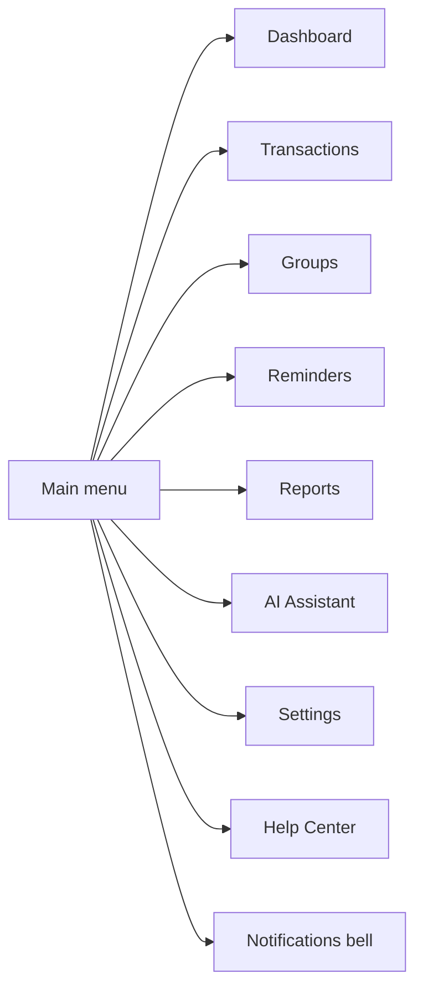

### Mobile app (bottom tabs)

Same core areas: **Dashboard · Transactions · Groups · Reminders · Reports · AI Assistant · Settings**

Plus: notifications and help from extra screens.

---

## Admin features — running the platform

Admins use a **separate website** to operate PaySaSuchan. They do **not** use the customer mobile app.

### What admins can do — in plain language

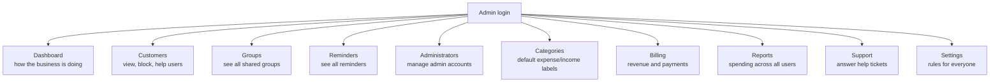

| Area | What admins do there |
|------|----------------------|
| **Dashboard** | See total users, spending volumes, charts, open support tickets |
| **Customers** | Search users; view their transactions; block or activate accounts; reset passwords; **give someone a plan** (free extension, Starter, or Pro) |
| **Groups** | View all groups on the platform; see members and who owes whom (read-only) |
| **Reminders** | View all reminders across the platform |
| **Administrators** | Add or remove admin staff |
| **Categories** | Manage default categories (Food, Travel, etc.) |
| **Billing** | See revenue, recent payments, how many users are on each plan |
| **Reports** | Platform-wide spending reports |
| **Support** | Read and reply to customer help tickets; change status; add internal notes |
| **Settings** | Set currency rules, notification defaults, **turn pricing on or off**, choose Razorpay vs Stripe |

### Important admin setting: Pricing on or off

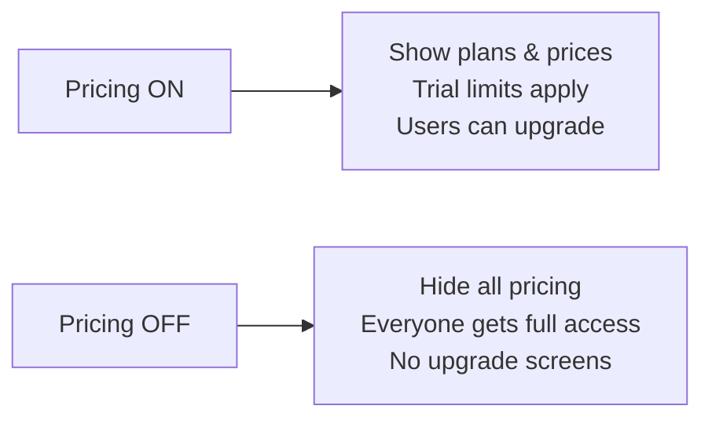

Use **Pricing OFF** when you want everyone to use the app for free while you are still setting up payments.

---

## End-to-end stories (how it fits together)

### Story A: Solo user tracks monthly spending

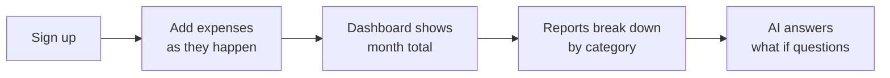

### Story B: Roommates split rent and utilities

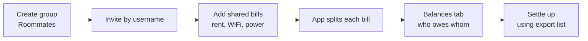

### Story C: User forgets a bill — reminder saves the day

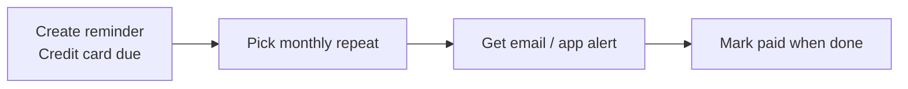

### Story D: Support ticket from customer to admin

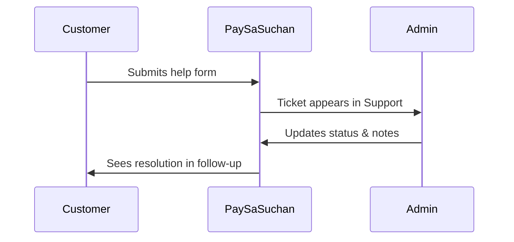

---

## What works on phone vs computer?

| Feature | Computer (website) | Phone (app) |
|---------|-------------------|-------------|
| Log in / Google sign-in | Yes | Yes |
| Full sign-up & password reset | Yes | Use website |
| Dashboard & transactions | Yes | Yes |
| Groups & splits | Yes | Yes |
| Reminders | Yes | Yes |
| Reports | Yes | Yes |
| AI chat & insights | Yes | Yes |
| Scan receipt with AI | Yes | Not yet |
| Import spreadsheet | Yes | Not yet |
| Pay / upgrade (all methods) | Yes | Partial — some payments on website |
| Download GST invoice PDF | Yes | Not yet |
| Admin panel | Yes | No |

---

## Glossary — simple definitions

| Term | Meaning |
|------|---------|
| **Transaction** | One record of money in (income) or money out (expense) |
| **Expense** | Money you spent |
| **Income / Credit** | Money you received |
| **Category** | Label for spending — Food, Rent, etc. |
| **Group** | Shared space to split bills with others |
| **Split** | How a bill is divided among group members |
| **Balance** | Who still owes money in a group |
| **Reminder** | A scheduled nudge about an upcoming payment |
| **GST invoice** | Tax document for a paid subscription |
| **Free trial** | Limited free period before choosing a paid plan |
| **Upgrade** | Moving to Starter or Pro for full access |

---

## Related documents

| Document | Audience |
|----------|----------|
| **This guide** (`product-guide.md`) | Everyone — non-technical |
| **Technical inventory** (`current-features.md`) | Developers and technical staff |
| **Billing go-live** (`release5.0/billing-go-live-checklist.md`) | Operations setting up payments |

---

*PaySaSuchan helps people see where their money goes, share costs fairly, and stay on top of bills — on web and mobile, with optional AI help along the way.*
