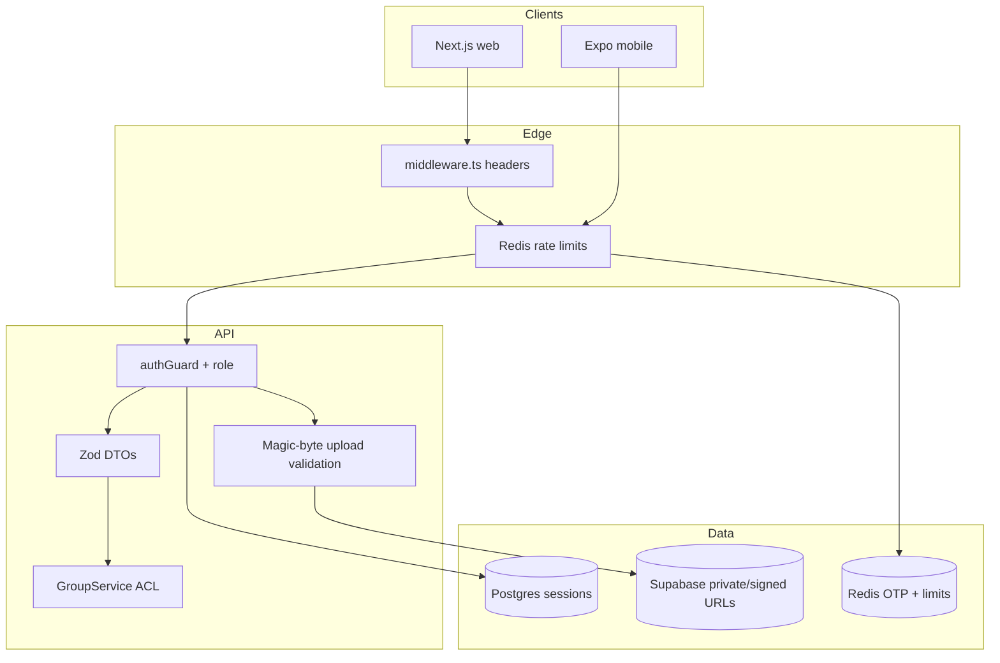

# Release 4.1 — AppSec & Design Checkpoint Remediation Plan

> **Purpose:** Security assessment and remediation backlog for **Corporate Pro Ledger (nexpo)** through Release 4.1 — covering web (Next.js), API layer, AI features, notifications, groups, and the in-progress Expo mobile client.
>
> **Audience:** Engineering, AppSec / Design Checkpoint reviewers, release owners.
>
> **Builds on:** `release4.0/remediation-plan.md` (P0–P4 largely complete), `release4.1/plan.md` (product scope), `AGENTS.md` (layered architecture).

---

## How to use this document

1. Treat items as **additive to 4.1 product work** — schedule AppSec phases alongside or after 4.1-S6 polish.
2. Mark tasks: `[ ]` todo · `[~]` in progress · `[x]` done · `[—]` accepted risk / deferred.
3. Each phase has a **gate checklist**; do not close the release security review until P0–P2 gates pass (or risks are explicitly accepted).
4. Update `release4.1/regression-checklist.md` when security tests land.

**Related docs**

| Doc | Role |
|-----|------|
| `release4.0/remediation-plan.md` | Completed security hardening (JWT, uploads, OTP, rate limit fail-closed) |
| `release4.1/plan.md` | Product features & env matrix |
| `release4.1/regression-checklist.md` | Manual QA before release |
| `tests/security/` | Automated security regression suite |

---

## Design Checkpoint / AppSec mapping

| Checkpoint theme | Primary nexpo surfaces | This plan phase |
|------------------|------------------------|-----------------|
| **Authentication & session** | JWT + DB session invalidation, OTP, password reset | AP-1, AP-2 |
| **Authorization (IDOR / RBAC)** | `authGuard`, group ACL, admin routes | AP-1, AP-3 |
| **Input validation & file upload** | `/api/upload`, transaction attachments, OCR | AP-0 |
| **API abuse / rate limiting** | `rateLimiter.ts`, auth & AI routes | AP-1 |
| **Secrets & config** | `.env`, cron secrets, OpenRouter / OneSignal keys | AP-0, AP-2 |
| **Client-side security** | localStorage JWT, Markdown XSS, CSP | AP-1, AP-2 |
| **Third-party integrations** | Supabase Storage, Resend, OneSignal, OpenRouter | AP-2 |
| **Mobile client** | Expo SecureStore vs AsyncStorage token duplication | AP-1 |
| **Dependency & supply chain** | npm audit, pinned AI SDK | AP-3 |
| **Logging & privacy** | Group member PII, AI audit (`AiUsage`) | AP-4 |

---

## Current state (Aug 2026 audit summary)

### Already remediated (Release 4.0 — do not re-open unless regressed)

| Area | Status | Evidence |
|------|--------|----------|
| Hardcoded JWT secret | Fixed | `JWT_SECRET` required; `tests/security/jwt-secret.test.ts` |
| Legacy unauthenticated `/api/expenses`, `/api/credits` | Removed | `tests/security/legacy-routes.test.ts` |
| Password reset token leak in API | Gated | `EXPOSE_DEV_RESET_TOKEN` + dev-only; integration tests |
| Plaintext password in localStorage | Removed | Login remember-me = email only |
| OTP `Math.random()` / in-memory store | Fixed | Redis + `crypto.randomInt`; production fail if Redis missing |
| Rate limit fail-open in production | Fixed | 503 when Redis unavailable in prod |
| Security response headers | Baseline | `middleware.ts` + `lib/security/responseHeaders.ts` |
| Markdown link XSS (AI assistant) | Sanitized | `lib/markdown/sanitizeLink.ts` + `Markdown.tsx` |
| Upload MIME whitelist + 10 MB cap | Partial | `lib/api/utils/fileUpload.ts` — **no magic-byte validation yet** |
| Server-side upload bucket | Fixed | `StorageService` uses env bucket, not client param |
| Layered API + `authGuard` on protected routes | In place | Controllers → services → repositories |
| Group ACL in services | In place | `GroupService.assertMember` / `assertAdmin` |
| Admin-only routes | Tested | `tests/security/admin-groups-reminders.test.ts`, `support-admin.test.ts` |

### Open findings (Release 4.1 AppSec backlog)

| ID | Severity | Category | Finding |
|----|----------|----------|---------|
| **SEC-01** | **Critical** | Config | `ENABLE_RESEND=false` + fixed `DEV_OTP_CODE=123456` allows predictable OTP on any environment where misconfigured (staging/public demo). |
| **SEC-02** | **High** | Client | JWT stored in **localStorage** (`nexpo_auth_store`) — XSS can steal bearer tokens; httpOnly session deferred in 4.0. |
| **SEC-03** | **High** | Mobile | Mobile auth persists **token in AsyncStorage** via Zustand (`nexpo_mobile_auth`) **in addition to** SecureStore — weaker storage wins on some paths. |
| **SEC-04** | **High** | Upload | Upload validation trusts **client `File.type` only** — renamed `.exe` → `.jpg` passes MIME check (`validateUploadFile`). |
| **SEC-05** | **High** | Storage | Supabase uploads use **public URLs** with predictable `{timestamp}_{filename}` paths — receipt/attachment URLs may be enumerable if bucket is public. |
| **SEC-06** | **High** | API abuse | **~40+ authenticated routes lack `checkRateLimit`** (groups, reminders, notifications, reports, admin reads, `/api/upload`, etc.). |
| **SEC-07** | **Medium** | CSP | Baseline CSP allows **`unsafe-inline` + `unsafe-eval`** — weak XSS mitigation; conflicts with strict AppSec checkpoint. |
| **SEC-08** | **Medium** | Third-party | **OneSignal** loads script from `cdn.onesignal.com` but CSP `script-src` is `'self'` only (+ unsafe-inline) — push may break or require CSP exception; needs explicit allowlist + SRI policy. |
| **SEC-09** | **Medium** | Secrets | `REMINDER_DISPATCH_SECRET` compared with `!==` — should use **timing-safe** compare; empty secret correctly fails closed (503). |
| **SEC-10** | **Medium** | Info disclosure | `GET /api/ai/health` (customer auth) exposes **resolved model IDs** — low sensitivity but unnecessary attack surface. |
| **SEC-11** | **Medium** | Client data | `transactionStore` caches full transaction list in **localStorage** — financial PII on shared devices. |
| **SEC-12** | **Medium** | Client data | Forced password reset flow stores **`nexpo_forced_reset_token` in localStorage**. |
| **SEC-13** | **Medium** | Privacy | Group detail API returns **member email/phone** to all group members — may exceed least-privilege for corporate deployments. |
| **SEC-14** | **Medium** | Dependencies | `npm audit` still reports transitive issues; P0.6 partially done — needs CI gate + documented exceptions. |
| **SEC-15** | **Low** | Headers | Missing **HSTS**, **Permissions-Policy** on HTML responses. |
| **SEC-16** | **Low** | Upload | `/api/upload` has **no dedicated rate limit** (only auth). |
| **SEC-17** | **Low** | Testing | Security tests cover auth guard, JWT, legacy routes, admin ACL — **gaps** for upload magic bytes, notification IDOR, dispatch auth, mobile storage. |

---

## Target security posture (4.1 gate)



---

## Phase AP-0 — Critical & production misconfiguration (P0)

**Goal:** Eliminate exploitable misconfig and upload bypass before external Design Checkpoint sign-off.

### Tasks

- [ ] **AP-0.1** Production OTP guard
  - **Files:** `lib/api/utils/emailConfig.ts`, `lib/api/services/otp.service.ts`, deploy docs
  - **Change:** In `NODE_ENV=production`, **refuse startup** (or refuse register/verify) if `ENABLE_RESEND=false` unless explicit `ALLOW_DEV_OTP_IN_PRODUCTION=true` (default false).
  - **Accept:** Public prod cannot verify with `123456`; staging uses distinct env profile documented in runbook.

- [ ] **AP-0.2** Magic-byte / content sniffing for uploads
  - **Files:** `lib/api/utils/fileUpload.ts`, `app/api/ai/ocr/route.ts` (reuse helper)
  - **Change:** Validate file signatures (JPEG/PNG/WebP/PDF) after reading buffer; reject mismatch with **415**.
  - **Accept:** Renamed executable fails; integration test added.

- [ ] **AP-0.3** Timing-safe internal cron secret
  - **Files:** `lib/api/utils/reminderDispatchAuth.ts`
  - **Change:** Compare secrets with `crypto.timingSafeEqual` on equal-length buffers; reject missing/malformed headers uniformly.
  - **Accept:** Unit test for wrong secret → 401; no secret → 503.

- [ ] **AP-0.4** Staging / demo environment checklist
  - **Files:** `release4.1/regression-checklist.md`, `README.md`
  - **Change:** Document required prod values: `ENABLE_RESEND=true`, Redis/KV, `REMINDER_DISPATCH_SECRET`, no `EXPOSE_DEV_RESET_TOKEN`, `SEED_DEMO_DATA` off in prod.
  - **Accept:** Design Checkpoint reviewer can verify env matrix in one page.

### AP-0 — Test plan

| ID | Type | Scenario | Expected |
|----|------|----------|----------|
| AP-0-T1 | Integration | Prod profile with `ENABLE_RESEND=false` | App refuses OTP verify or fails startup |
| AP-0-T2 | Integration | Upload `.exe` renamed `.jpg` | 415 |
| AP-0-T3 | Unit | Dispatch auth wrong secret | 401; timing-safe path |
| AP-0-T4 | Manual | Production `.env` review | No dev OTP / dev reset flags |

**Phase gate:** AP-0-T1–T4 pass.

---

## Phase AP-1 — High: client tokens, rate limits, storage access (P1)

**Goal:** Close high-risk client and API abuse gaps introduced or exposed by 4.1 features (groups, notifications, mobile).

### Tasks

- [ ] **AP-1.1** Rate-limit coverage audit
  - **Files:** all `app/api/**/route.ts`, `lib/api/middleware/rateLimiter.ts`
  - **Change:** Add `checkRateLimit` to unprotected write routes and high-cost reads:
    - `/api/upload` (per user, e.g. 20/min)
    - `/api/user/groups/**` writes & invites
    - `/api/user/reminders/**`
    - `/api/user/notifications/**` (except simple GET with low cost — optional per-IP cap)
    - `/api/user/reports`, import/export endpoints
    - Admin bulk reads if abused in pentest
  - **Accept:** Documented preset table in `release4.0/api-contract.md` or new `release4.1/api-contract.md` §Rate limits; 429 on burst.

- [ ] **AP-1.2** Web JWT storage decision (Design Checkpoint item)
  - **Options:**
    - **A (recommended long-term):** httpOnly secure cookie session + CSRF token for mutating routes
    - **B (minimum 4.1):** Harden XSS surface (CSP AP-2), shorten JWT TTL, rotate on sensitive actions, document residual risk in `release4.1/appsec-remediation-plan.md`
  - **Files:** `store/authStore.ts`, `components/auth/AuthContext.tsx`, `lib/api/services/auth.service.ts`
  - **Accept:** Written decision + at least JWT expiry review (e.g. 24h access + refresh or re-login on password change — already invalidates sessions).

- [ ] **AP-1.3** Mobile token storage hardening
  - **Files:** `mobile/src/store/authStore.ts`, `mobile/src/lib/tokenStorage.ts`, `mobile/src/context/AuthContext.tsx`
  - **Change:** **Remove JWT from Zustand persist**; store token **only** in `expo-secure-store`; profile in AsyncStorage if needed.
  - **Accept:** Token not present in AsyncStorage dump; mobile security note in `mobile/README.md`.

- [ ] **AP-1.4** Supabase attachment access model
  - **Files:** `lib/api/services/storage.service.ts`, Supabase bucket policy
  - **Change:** Prefer **private bucket + signed URLs** (time-limited) or path scoped per `userId`; stop relying on public URLs for receipts.
  - **Accept:** Unauthenticated GET to another user's object path fails; document bucket policy in deploy guide.

- [ ] **AP-1.5** Clear sensitive localStorage on logout
  - **Files:** `store/authStore.ts`, `store/transactionStore.ts`, auth forms using `nexpo_forced_reset_*`, `nexpo_pending_email`
  - **Change:** Central `clearClientSecrets()` on logout: auth token, forced reset token, optional transaction cache.
  - **Accept:** After logout, Application → Local Storage has no JWT or reset tokens.

### AP-1 — Test plan

| ID | Type | Scenario | Expected |
|----|------|----------|----------|
| AP-1-T1 | Integration | Burst group invite API | 429 after preset |
| AP-1-T2 | Integration | Burst `/api/upload` | 429 |
| AP-1-T3 | Manual | Mobile AsyncStorage after login | No bearer token key |
| AP-1-T4 | Manual | Access receipt URL without auth | 403/404 (signed URL expired or private) |
| AP-1-T5 | Manual | Logout → inspect localStorage | No `nexpo_auth_store` token / reset tokens |

**Phase gate:** AP-1-T1–T5 pass.

---

## Phase AP-2 — Medium: CSP, third-party scripts, disclosure (P2)

**Goal:** Align with Design Checkpoint expectations for browser security and third-party integrations (OneSignal, OpenRouter, Supabase, Google Fonts).

### Tasks

- [ ] **AP-2.1** CSP tightening (incremental)
  - **Files:** `lib/security/responseHeaders.ts`
  - **Change:**
    - Add **`https://cdn.onesignal.com`** to `script-src` (if keeping OneSignal) or self-host worker strategy
    - Add **`https://api.onesignal.com`** to `connect-src`
    - Add **`https://openrouter.ai`** (and AI SDK endpoints) to `connect-src`
    - Plan removal of **`unsafe-eval`** (Next.js may require nonce strategy — document constraint)
    - Add **`Strict-Transport-Security`** in production
    - Add **`Permissions-Policy`** (camera/mic/geolocation disabled if unused)
  - **Accept:** OneSignal + AI chat work under CSP; securityheaders.com scan improved.

- [ ] **AP-2.2** Restrict AI health endpoint
  - **Files:** `app/api/ai/health/route.ts`
  - **Change:** Return `{ enabled: boolean }` only to customers; move model list to **admin-only** route or strip in production.
  - **Accept:** Customer JWT cannot enumerate internal model configuration.

- [ ] **AP-2.3** OneSignal registration hardening
  - **Files:** `lib/api/controllers/notification.controller.ts`, DTO
  - **Change:** Validate `playerId` format/length; rate-limit register; optionally verify subscription server-side before storing.
  - **Accept:** Cannot associate arbitrary playerId with victim userId without auth.

- [ ] **AP-2.4** OpenRouter / AI cost guards (operational security)
  - **Files:** `lib/ai/config.ts`, `app/api/ai/*`, deploy docs
  - **Change:** Document OpenRouter spending limits + Google AI Studio integration link; alert on `AiUsage` ERROR spike.
  - **Accept:** Runbook section for AI abuse / quota exhaustion (already user rate-limited per day).

### AP-2 — Test plan

| ID | Type | Scenario | Expected |
|----|------|----------|----------|
| AP-2-T1 | Manual | Customer portal with OneSignal enabled | No CSP console violations; push registers |
| AP-2-T2 | Manual | AI assistant streaming | Works under updated `connect-src` |
| AP-2-T3 | Integration | `GET /api/ai/health` as customer | No model slug list (after change) |
| AP-2-T4 | Manual | Response headers on `/customer` | HSTS (prod), Permissions-Policy present |

**Phase gate:** AP-2-T1–T4 pass.

---

## Phase AP-3 — Authorization tests & dependency hygiene (P3)

**Goal:** Prove 4.1 domain ACL with automated tests; keep supply chain auditable.

### Tasks

- [ ] **AP-3.1** Group IDOR integration matrix
  - **Files:** `tests/integration/groups/` (extend), `tests/security/`
  - **Scenarios:**
    - Non-member cannot read group, transactions, balances, reminders
    - Member cannot delete another member's transaction (unless admin/creator per rules)
    - Non-admin cannot promote/remove members
    - Admin groups routes remain admin-only
  - **Accept:** Matrix table in test file; CI green.

- [ ] **AP-3.2** Notification IDOR tests
  - **Files:** `tests/security/notifications.test.ts` (new)
  - **Change:** User A cannot mark read / list as User B; push register binds to authenticated user only.
  - **Accept:** 403/404 on cross-user notification id.

- [ ] **AP-3.3** Reminder dispatch integration test
  - **Files:** `tests/integration/reminders/dispatch.test.ts` (extend)
  - **Change:** Cover missing secret, wrong secret, valid secret; ensure no user data leak in response.
  - **Accept:** Already partially covered — extend for timing-safe helper.

- [ ] **AP-3.4** Upload security tests
  - **Files:** `tests/security/upload.test.ts` (new)
  - **Change:** Magic-byte rejection, size limit, auth required.
  - **Accept:** Automated AP-0-T2 regression.

- [ ] **AP-3.5** CI npm audit gate
  - **Files:** `.github/workflows/*` or release gate docs
  - **Change:** `npm audit --audit-level=high` on direct deps; document allowed exceptions in `release4.1/appsec-remediation-plan.md`.
  - **Accept:** CI fails on new high CVEs without exception note.

### AP-3 — Test plan

| ID | Type | Scenario | Expected |
|----|------|----------|----------|
| AP-3-T1 | Automated | `npm run test:security` (new suite) | All pass |
| AP-3-T2 | Automated | Group IDOR matrix | All pass |
| AP-3-T3 | CI | npm audit high | Pass or listed exception |

**Phase gate:** AP-3-T1–T3 pass.

---

## Phase AP-4 — Privacy, audit, and corporate readiness (P4)

**Goal:** Address enterprise Design Checkpoint questions on data minimization and auditability.

### Tasks

- [ ] **AP-4.1** Group member field minimization
  - **Files:** `lib/api/services/group.service.ts`, group DTOs, UI member panels
  - **Change:** Return **username + display name** by default; expose email/phone only to admins or invite flows.
  - **Accept:** Product decision documented; API contract updated.

- [ ] **AP-4.2** Admin audit completeness
  - **Files:** `lib/api/repositories/*`, admin services for settings, support triage, notification policy
  - **Change:** Ensure **audit rows** for: global notification policy changes, support status changes, admin password resets (verify existing coverage).
  - **Accept:** Admin audit log shows 4.1-sensitive actions.

- [ ] **AP-4.3** AI usage audit review
  - **Files:** `lib/api/repositories/aiUsage.repository.ts`
  - **Change:** Confirm no PII in `error` column; retention policy documented (e.g. 90 days).
  - **Accept:** AppSec sign-off on `AiUsage` table.

- [ ] **AP-4.4** Mobile AppSec notes (in-progress client)
  - **Files:** `mobile/README.md`, `mobile/AGENTS.md`
  - **Change:** Document: cert pinning (future), jailbreak/root risks, `EXPO_PUBLIC_API_URL` TLS requirement, no secrets in mobile bundle.
  - **Accept:** Design Checkpoint acknowledges mobile as beta with listed gaps.

### AP-4 — Test plan

| ID | Type | Scenario | Expected |
|----|------|----------|----------|
| AP-4-T1 | Manual | Member views group roster | No peer email unless policy allows |
| AP-4-T2 | Manual | Change admin notification policy | Audit entry created |

**Phase gate:** AP-4-T1–T2 pass or accepted product exception.

---

## Phase AP-5 — Design Checkpoint deliverables (documentation)

**Goal:** Package evidence for AppSec / Design Checkpoint reviewers.

### Tasks

- [ ] **AP-5.1** Threat model (1–2 pages)
  - **Create:** `release4.1/threat-model.md`
  - **Contents:** Trust boundaries (browser, mobile, Vercel, Supabase, OpenRouter, OneSignal, Resend, cron); STRIDE top 5 threats; mitigations mapped to phases AP-0–AP-4.

- [ ] **AP-5.2** Security regression checklist
  - **Update:** `release4.1/regression-checklist.md` — add AppSec section (OTP prod guard, upload magic bytes, rate limits, CSP smoke, mobile token storage).

- [ ] **AP-5.3** Accepted risks register
  - **Update:** This doc §Risk register — sign-off names, expiry dates for deferred items (e.g. httpOnly cookies → 4.2).

- [ ] **AP-5.4** Pen test handoff bundle
  - **Create:** `release4.1/pentest-scope.md` — in-scope URLs, test accounts, out-of-scope (mobile store builds until EAS), rate limit notes.

**Phase gate:** Documents reviewed by engineering lead before external Design Checkpoint.

---

## Consolidated test commands

```bash
# Existing
npm run test:security          # extend with new files under tests/security/
npm run test:integration       # groups, reminders, auth
npm audit --audit-level=high

# Recommended new script (add in package.json when tests land)
# npm run test:appsec
```

---

## Risk register (4.1 AppSec)

| Risk | Likelihood | Impact | Mitigation | Owner phase |
|------|------------|--------|------------|-------------|
| Predictable OTP on misconfigured prod | Medium | Critical | AP-0.1 | AP-0 |
| XSS → JWT theft (localStorage) | Medium | High | AP-1.2 + AP-2.1 | AP-1 / AP-2 |
| Malicious file upload | Low | High | AP-0.2 | AP-0 |
| Public receipt URL enumeration | Medium | High | AP-1.4 | AP-1 |
| API abuse on new 4.1 endpoints | Medium | Medium | AP-1.1 | AP-1 |
| OneSignal CSP bypass / breakage | Medium | Medium | AP-2.1 | AP-2 |
| Group member PII overexposure | Medium | Medium | AP-4.1 | AP-4 |
| Mobile token in AsyncStorage | High | High | AP-1.3 | AP-1 |
| Cron secret brute force | Low | Medium | AP-0.3 + network ACL | AP-0 |
| AI quota exhaustion / cost | Medium | Medium | AP-2.4 + existing per-user limits | AP-2 |
| Dependency CVE recurrence | Medium | Medium | AP-3.5 | AP-3 |

---

## Suggested sequencing with Release 4.1 product sprints

| Product sprint | Parallel AppSec work |
|----------------|---------------------|
| 4.1-S1 (auth / OTP) | **AP-0.1**, AP-0.4 |
| 4.1-S2 (admin settings / support) | AP-4.2 audit review |
| 4.1-S3–S4 (groups / splits) | **AP-3.1**, AP-1.1 (group rate limits) |
| 4.1-S5 (notifications / push) | **AP-2.1**, AP-2.3, AP-3.2 |
| 4.1-S6 (polish / dispatch) | **AP-0.3**, AP-3.3 |
| Post-4.1 / mobile beta | **AP-1.3**, AP-4.4 |
| Design Checkpoint gate | **AP-5** documentation bundle |

---

## Out of scope (4.1 AppSec — track for 4.2+)

- Full httpOnly cookie + CSRF migration (large change; AP-1.2 option A)
- WhatsApp reminder channel security
- WAF / bot management at edge (Vercel / Cloudflare)
- SOC2 logging pipeline / SIEM integration
- Mobile certificate pinning and jailbreak detection
- Field-level encryption at rest for PII columns
- Row-level security in Postgres (RLS) — currently app-layer ACL only

---

*Last updated: 2026-08-26 · Release 4.1 AppSec remediation plan (audit-based; items not yet implemented unless marked [x] in phase tasks)*
