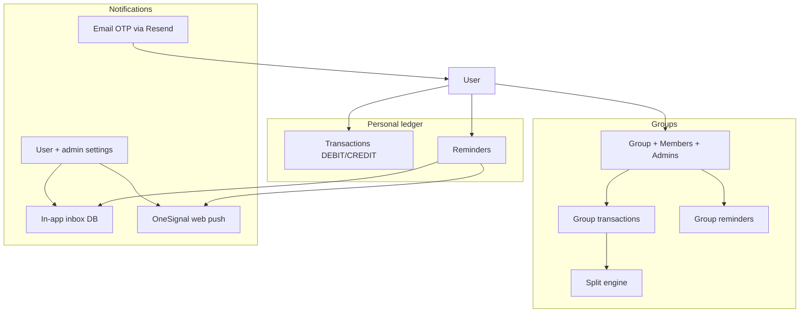

# Release 4.1 — Product Completion & Group Expenses

> **Purpose:** Close Release 4.0 gaps (auth, admin settings, support UI), introduce **group expense splitting** with proportional allocation, **payment reminders**, and **username-based identity** for invites.
>
> **Builds on:** Release 4.0 layered architecture (`AGENTS.md`), unified transaction stack, Redis OTP/rate limits, test foundation (`tests/`).
>
> **Out of scope (4.1):** WhatsApp reminders, AI feature backlog (`release4.0/features.md`), native mobile app binaries (push SDK is future-ready), httpOnly cookie migration, standalone credit ledger revival.

---

## How to use this document

1. Work **sprint by sprint** — each sprint has a gate checklist.
2. Mark tasks: `[ ]` todo · `[~]` in progress · `[x]` done · `[—]` deferred.
3. Schema changes require `prisma migrate` + update `release4.1/schema-draft.prisma` → final migration.
4. API shapes live in `release4.1/api-contract.md`.
5. Run `npm run test:all` + manual regression before release tag.

**Related docs**

| Doc | Role |
|-----|------|
| `release4.1/api-contract.md` | New endpoints & envelopes |
| `release4.1/appsec-remediation-plan.md` | AppSec / Design Checkpoint findings & phased fixes |
| `release4.1/schema-draft.prisma` | Proposed Prisma models |
| `release4.0/remediation-plan.md` | Completed foundation (4.0) |
| `AGENTS.md` | Layered architecture conventions |

---

## Feature intake (your list → release scope)

| # | Request | 4.1 disposition |
|---|---------|-----------------|
| 1 | `/customer/credit`, `/customer/expenses` redirects only | **P1** — Remove dead routes; update any stale links; single nav entry “Transactions” |
| 2 | Customer forgot/reset password (UI only) | **P1** — Full backend + wire forms (mirror admin flow) |
| 3 | Admin settings fake save | **P2** — Persist `SystemSetting` in DB; load on page open |
| 4 | Admin support triage (API only) | **P2** — Admin UI: list, detail, status, notes, close |
| 5 | Standalone credit ledger removed in 4.0 | **No work** — Document as intentional; CREDIT stays in unified transactions |
| 6 | Groups (invite by username/email/phone) | **P3** — Core group CRUD + membership |
| 7 | Group admin (creator default; promote later) | **P3** — `GroupMemberRole`: ADMIN \| MEMBER |
| 8 | Members add expenses; edit **own** only | **P4** — Group transaction ACL in service layer |
| 9 | Group credit/expense = same DEBIT/CREDIT flow | **P4** — Reuse transaction fields + `groupId` |
| 10 | Left nav “Groups” | **P3** — `/customer/groups` list + detail |
| 11 | Payment reminders (personal + group; in-app first) | **P5** — Reminder model + notification delivery stack |
| 12 | Proportional / omit / custom split on group expenses | **P4** — `GroupExpenseSplit` (flagship feature) |
| 13 | Email OTP via Resend (env-gated) | **P1** — `ENABLE_RESEND` flag; dev OTP `123456` when off |
| 14 | Push / in-app notifications (browser + future mobile) | **P5** — **OneSignal** (chosen); FCM noted as alt |
| 15 | Notification settings (customer + admin global) | **P2 + P5** — Admin policy defaults; customer opt-in/out |

---

## Target product shape



**Split modes (feature #12)**

| Mode | Behavior |
|------|----------|
| `EQUAL_INCLUDED` | Total ÷ count of included members (default) |
| `CUSTOM_AMOUNT` | Fixed amount per member; sum must equal expense total |
| `CUSTOM_PERCENT` | Percent per member; percents sum to 100 |
| `EXCLUDE` | Member flagged `included: false` — pays ₹0, omitted from equal split denominator |

Combinations: start with **single mode per expense** in MVP; v2 can allow “equal among remaining + custom overrides” if needed.

---

## Sprint plan (6 sprints)

| Sprint | Phase | Scope | Gate |
|--------|-------|-------|------|
| **4.1-S1** | P1 | Route cleanup + customer password reset + **Email OTP gating** | Auth integration tests green |
| **4.1-S2** | P2 | Admin settings persistence + support inbox UI + **global notification policy** | Admin manual checklist |
| **4.1-S3** | P3 | Username + groups membership + nav | User can create/join group |
| **4.1-S4** | P4 | Group transactions + split engine | Split math tests + UI |
| **4.1-S5** | P5 | Reminders + **OneSignal push** + **customer notification settings** + in-app inbox | Reminder CRUD + push opt-in |
| **4.1-S6** | Polish | Email reminder dispatch, settlements summary, docs | `test:all` + regression |

---

## P1 — Route cleanup & customer password reset

**Goal:** No stub auth flows; remove confusing legacy routes.

### Tasks

- [x] **P1.1** Remove or 301 redirect pages
  - **Delete or consolidate:** `app/customer/credit/page.tsx`, `app/customer/expenses/page.tsx`, `app/credit/page.tsx`
  - **Accept:** No orphan routes in sitemap; grep shows no `/customer/credit` nav links.

- [x] **P1.2** Customer forgot password API
  - **Create:** `POST /api/user/auth/forgot-password`
  - **Service:** `AuthService.forgotUserPassword(email)` — mirror admin: token in `PasswordResetToken`, email via `EmailService` when `ENABLE_RESEND=true` (simulated log when false), no enumeration leak
  - **Rate limit:** reuse `RATE_LIMIT_PRESETS.adminForgotPassword` pattern per IP
  - **Accept:** Unknown email still returns `{ success: true }`.

- [x] **P1.3** Customer reset password API
  - **Create:** `POST /api/user/auth/reset-password` `{ token, password }`
  - **Service:** `AuthService.resetUserPassword` — validate token, hash password, invalidate sessions, mark token used
  - **Accept:** Used/expired token returns 400 `{ error }`.

- [x] **P1.4** Wire UI
  - **Files:** `ForgotPasswordForm.tsx`, `ResetPasswordForm.tsx`
  - **Change:** Call APIs; handle errors; optional dev token only when `EXPOSE_DEV_RESET_TOKEN=true`
  - **Accept:** Full flow register → login → forgot → reset works in manual test.

- [x] **P1.5** Email OTP — Resend env gate (feature #13)
  - **Env:** `ENABLE_RESEND=false` (default) · `ENABLE_RESEND=true` requires `RESEND_API_KEY` (+ optional `RESEND_FROM_EMAIL`)
  - **When `ENABLE_RESEND=false`:**
    - `OtpService.createOtp()` stores fixed code **`123456`** in Redis (still respects TTL + max attempts)
    - `EmailService.sendOtpEmail()` **skipped** (log `[OTP Dev Mode]` with email only — never log code in production)
    - Register / resend-OTP / verify flows unchanged from caller perspective
  - **When `ENABLE_RESEND=true`:**
    - Generate cryptographically random 6-digit OTP (existing behavior)
    - Send via Resend using real credentials; throw/log failure if send fails (do not fall back to `123456`)
  - **Layers:** `OtpService`, `EmailService`, `lib/api/utils/emailConfig.ts` (single source for flag + validation)
  - **Accept:** Unit test both modes; integration test verify with `123456` when flag off.

- [x] **P1.6** Password-reset email uses same gate
  - **Change:** `EmailService.sendPasswordResetEmail()` respects `ENABLE_RESEND` (simulated link log when off; real Resend when on)
  - **Accept:** Customer + admin reset flows behave consistently with OTP gate.

- [x] **P1.7** Tests
  - **Create:** `tests/integration/auth/customer-reset.test.ts`, `tests/unit/services/otp-resend-gate.test.ts`
  - **Accept:** Mirrors `admin-reset.test.ts` coverage; OTP gate covered for both env values.

### P1 — Test plan

| ID | Scenario | Expected |
|----|----------|----------|
| P1-T1 | POST forgot-password valid email | 200; token row created |
| P1-T2 | POST reset-password valid token | 200; can login with new password |
| P1-T3 | POST reset-password twice | Second call fails |
| P1-T4 | Forgot form network error | Error toast, no fake success |
| P1-T5 | `ENABLE_RESEND=false` register + verify `123456` | User activated |
| P1-T6 | `ENABLE_RESEND=false` wrong OTP | 400; attempts increment |
| P1-T7 | `ENABLE_RESEND=true` without `RESEND_API_KEY` | Startup/config error or send failure surfaced |

---

## P2 — Admin settings & support triage

**Goal:** Admin can persist policy settings and manage support tickets.

### Tasks

- [x] **P2.1** System settings model
  - **Schema:** `SystemSetting` (key, value JSON, updatedByAdminId, timestamps)
  - **Seed defaults:** `baseCurrency`, `matchingRate`, `requireReceipt`, `autoApproveLimit`
  - **Notification policy keys** (admin global — feature #15):
    - `notifications.pushEnabled` — master switch for OneSignal delivery (default `true`)
    - `notifications.emailRemindersEnabled` — allow email channel for reminders (default `true`; requires `ENABLE_RESEND=true` to actually send)
    - `notifications.inAppEnabled` — master switch for in-app inbox (default `true`)
    - `notifications.defaultChannels` — e.g. `["IN_APP"]` for new reminders
  - **Accept:** Single row per key; upsert on save; customer prefs cannot override admin-off channels.

- [x] **P2.2** Settings API
  - **Create:** `GET/PATCH /api/admin/settings`
  - **Layers:** `settings.controller.ts`, `settings.service.ts`, `settings.repository.ts`, `settings.dto.ts`
  - **Accept:** PATCH validates with Zod; audit optional (admin action log).

- [x] **P2.3** Wire admin settings page
  - **File:** `app/admin/settings/page.tsx`
  - **Change:** Load on mount; save via API; show real DB/error states (remove `setTimeout` fake save)
  - **Add section:** “Notification policy” — toggles for push / email reminders / in-app; show read-only hint when `ENABLE_RESEND=false` (“OTP & auth emails simulated; reminder email dispatch disabled at infra level”)
  - **Accept:** Refresh page shows persisted values; disabling push globally prevents OneSignal sends even if user opted in.

- [x] **P2.4** Admin support inbox UI
  - **Create:** `app/admin/support/page.tsx`, `app/admin/support/[id]/page.tsx`
  - **Components:** `components/features/support/` — ticket list, detail, status badge, admin notes editor
  - **API:** Existing `GET/PATCH/DELETE /api/admin/support/*`
  - **Nav:** Add “Support” to `ADMIN_NAV_LINKS` (badge with open count optional)
  - **Accept:** Admin can open ticket from dashboard link, change status `A`→`I`, add notes.

- [x] **P2.5** Tests
  - **Create:** `tests/integration/admin/settings.test.ts`, `tests/security/support-admin.test.ts`

### P2 — Test plan

| ID | Scenario | Expected |
|----|----------|----------|
| P2-T1 | PATCH settings as admin | 200; GET returns new values |
| P2-T2 | GET settings as customer | 403 |
| P2-T3 | List support tickets | Paginated `{ items, total }` |
| P2-T4 | Close ticket + notes | Status `I`; audit row |

---

## P3 — Username & groups foundation

**Goal:** Users discover each other; create and join groups.

### Tasks

- [x] **P3.1** Username on User
  - **Schema:** `User.username String? @unique` → migrate to required for new registrations
  - **Validation:** `^[a-z0-9_]{3,30}$`, case-insensitive unique
  - **Profile:** Add username to register + settings (with uniqueness check)
  - **Accept:** Invite lookup resolves username OR email OR phone.

- [x] **P3.2** Group core schema
  - **Models:** `Group`, `GroupMember`, `GroupInvite` (see `schema-draft.prisma`)
  - **Roles:** `GroupMemberRole` enum: ADMIN, MEMBER
  - **Accept:** Creator inserted as ADMIN on group create.

- [x] **P3.3** Group APIs (customer)
  - `GET/POST /api/user/groups`
  - `GET/PATCH/DELETE /api/user/groups/[id]`
  - `POST /api/user/groups/[id]/members` — invite by `{ username \| email \| phone }`
  - `POST /api/user/groups/[id]/members/[memberId]/promote` — ADMIN only
  - `DELETE /api/user/groups/[id]/members/[memberId]` — remove member (ADMIN or self-leave)
  - **Accept:** Non-member cannot read group transactions (403).

- [x] **P3.4** Customer UI — Groups nav
  - **Nav:** Add `{ name: 'Groups', path: '/customer/groups', icon: 'groups' }`
  - **Pages:** `/customer/groups` (list), `/customer/groups/[id]` (detail shell: members tab)
  - **Components:** `components/features/groups/` barrel export
  - **Accept:** User sees only groups they belong to.

- [x] **P3.5** Tests
  - **Create:** `tests/integration/groups/membership.test.ts`

### P3 — Test plan

| ID | Scenario | Expected |
|----|----------|----------|
| P3-T1 | Create group | Creator is ADMIN member |
| P3-T2 | Invite by email | Pending invite or auto-join if user exists |
| P3-T3 | Promote member | Second ADMIN can manage group |
| P3-T4 | Non-member GET group | 403 |

---

## P4 — Group transactions & split engine

**Goal:** Same DEBIT/CREDIT UX as personal ledger, with flexible splits.

### Tasks

- [x] **P4.1** Extend transaction model for groups
  - **Schema:** Add optional `groupId`, `createdByUserId` (already userId on Transaction — clarify: `userId` = payer/owner, `groupId` = scope)
  - **Decision:** Add `groupId String?` + relation on `Transaction`; group expenses are rows with `groupId` set
  - **Alternative rejected:** Separate table duplicates OCR/import/recurring logic

- [x] **P4.2** Split schema
  - **Models:** `GroupExpenseSplit` — one row per member per transaction
  - **Fields:** `transactionId`, `userId`, `included`, `shareAmount`, `sharePercent`, `computedAmount`
  - **Service:** `SplitService.calculate(mode, total, participants)` — pure function, unit tested

- [x] **P4.3** Group transaction APIs
  - `GET /api/user/groups/[id]/transactions` — list with splits
  - `POST /api/user/groups/[id]/transaction` — create DEBIT/CREDIT + splits payload
  - `PATCH/DELETE /api/user/groups/[id]/transaction/[txnId]` — **only creator** OR group ADMIN
  - **Accept:** Member can create; cannot edit another member's entry unless ADMIN.

- [x] **P4.4** Split UI on group expense form
  - **Modes:** Toggle equal / custom amount / custom % / exclude members (checkbox per member)
  - **Live preview:** “You owe ₹X” per member before save
  - **Validation:** Client + server reject invalid totals
  - **Reuse:** Transaction form fields (category, payment type, document upload, OCR)

- [x] **P4.5** Group balance summary (MVP)
  - **UI tab:** “Balances” — net owed per member from splits (no cash settlement tracking in 4.1)
  - **API:** `GET /api/user/groups/[id]/balances` — aggregate splits

- [x] **P4.6** Tests
  - **Create:** `tests/unit/services/split.service.test.ts`
  - **Create:** `tests/integration/groups/transactions.test.ts`

### P4 — Split validation rules

```
EQUAL_INCLUDED:
  includedMembers = members where included=true
  each.computedAmount = total / includedMembers.length (round last penny to payer)

CUSTOM_AMOUNT:
  sum(shareAmount for included) == total (±0.01)

CUSTOM_PERCENT:
  sum(sharePercent for included) == 100
  computedAmount = total * (sharePercent / 100)

EXCLUDE:
  included=false → computedAmount=0, excluded from equal split count
```

### P4 — Test plan

| ID | Scenario | Expected |
|----|----------|----------|
| P4-T1 | Equal split 3 members ₹300 | ₹100 each |
| P4-T2 | Exclude 1 of 4, equal rest | ₹100 × 3 |
| P4-T3 | Custom amounts | Server rejects if sum ≠ total |
| P4-T4 | Member edits own txn | 200 |
| P4-T5 | Member edits other's txn | 403 |
| P4-T6 | ADMIN edits any txn | 200 |

---

## P5 — Payment reminders & notification platform

**Goal:** Reminders for personal ledger and groups; unified in-app inbox + optional push (OneSignal) and email; customer + admin notification controls.

### Push provider decision (feature #14)

| Option | Web push | Future mobile | Server send | Verdict |
|--------|----------|---------------|-------------|---------|
| **OneSignal** | Web SDK + service worker | Same vendor iOS/Android SDK | REST API from Node | **Chosen for 4.1** |
| Firebase FCM | Web via FCM + service worker | Android native; iOS needs APNs wiring | Firebase Admin SDK | Viable alt; defer unless Firebase already adopted |

**Rationale:** OneSignal gives one dashboard, one REST sender, and one client SDK path for browser today and React Native / Expo later — without standing up Firebase + APNs separately.

### Notification delivery model

```
Effective send(channel) =
  adminGlobal.notifications.<channel>Enabled
  AND userPreference.<channel>Enabled
  AND (channel != EMAIL OR ENABLE_RESEND=true)
  AND (channel != PUSH OR user has OneSignal subscription)
```

### Tasks

- [x] **P5.1** Reminder + notification schema
  - **Model:** `PaymentReminder` — scope: `userId` XOR `groupId` (personal vs group)
  - **Fields:** title, amount?, dueDate, notes, recurrence (NONE \| MONTHLY \| WEEKLY), channels `String[]` (subset of `IN_APP`, `EMAIL`, `PUSH`)
  - **Model:** `InAppNotification` — `userId`, `type`, `title`, `body`, `payload` JSON, `readAt?`, `createdAt`
  - **Model:** `UserNotificationPreference` — per-user toggles: `inApp`, `email`, `push`, `groupActivity`
  - **Model:** `UserPushSubscription` — `userId`, `onesignalPlayerId`, `platform` (WEB \| IOS \| ANDROID), `lastSeenAt`
  - **Model:** `NotificationDelivery` — log of sent attempts (channel, status, error, reminderId?)
  - **Accept:** Group reminder fan-out creates one `InAppNotification` per member.

- [x] **P5.2** Reminder APIs
  - Personal: `GET/POST/PATCH/DELETE /api/user/reminders`
  - Group: `GET/POST/PATCH/DELETE /api/user/groups/[id]/reminders` (ADMIN create; all members view)
  - **Accept:** Group reminder visible to all members in group detail.

- [x] **P5.3** Notification APIs
  - `GET /api/user/notifications` — paginated inbox (`unreadCount` in meta)
  - `PATCH /api/user/notifications/[id]/read` · `POST /api/user/notifications/read-all`
  - `GET/PATCH /api/user/notification-preferences` — customer settings (feature #15)
  - `POST /api/user/notifications/push/register` — store OneSignal `playerId` after browser opt-in
  - **Accept:** Preferences PATCH rejected for channels disabled by admin global policy.

- [x] **P5.4** OneSignal integration (server + client)
  - **Server:** `lib/api/services/push.service.ts` — `PushService.send(userIds, payload)` via OneSignal REST (`ONESIGNAL_APP_ID`, `ONESIGNAL_REST_API_KEY`)
  - **Client:** `components/features/notifications/OneSignalProvider.tsx` — init SDK, prompt opt-in, register player ID
  - **Service worker:** `public/OneSignalSDKWorker.js` (or SDK-managed path per OneSignal docs)
  - **Layout:** Bell icon + dropdown in customer shell; unread badge
  - **Accept:** Due reminder creates in-app row; if push enabled + subscribed, OneSignal notification fires.

- [x] **P5.5** Customer notification settings UI (feature #15)
  - **File:** `app/customer/settings/page.tsx` — new “Notifications” card
  - **Toggles:** In-app, email reminders, push (push toggle disabled until browser permission granted)
  - **Copy:** Explain admin may disable channels globally
  - **Accept:** Saving prefs persists; reminder dispatch respects combined admin + user flags.

- [x] **P5.6** In-app notification surfaces
  - **Dashboard widget:** “Upcoming reminders” (7-day window)
  - **Group detail:** Reminders tab
  - **Mark done/snooze:** PATCH reminder `status` or `snoozedUntil`
  - **Inbox:** Full list at `/customer/notifications` (optional page) or bell panel
  - **Accept:** In-app channel works with zero external credentials.

- [x] **P5.7** Email reminders (4.1-S6)
  - **Job:** Cron or Vercel cron hits `/api/internal/reminders/dispatch` (protected by `REMINDER_DISPATCH_SECRET`)
  - **Uses:** `EmailService` only when `ENABLE_RESEND=true` AND admin `emailRemindersEnabled` AND user pref
  - **Defer channel:** WhatsApp → Release 4.2

- [x] **P5.8** Tests
  - **Create:** `tests/integration/reminders/crud.test.ts`, `tests/integration/notifications/preferences.test.ts`, `tests/unit/services/push.service.test.ts` (mock OneSignal HTTP)

### P5 — Test plan

| ID | Scenario | Expected |
|----|----------|----------|
| P5-T1 | Create personal reminder | Appears on dashboard + inbox |
| P5-T2 | Create group reminder as MEMBER | 403 |
| P5-T3 | Create group reminder as ADMIN | All members get in-app notification |
| P5-T4 | Snooze reminder | Hidden until snooze date |
| P5-T5 | Admin disables push globally | OneSignal send skipped |
| P5-T6 | User disables email; admin allows | No reminder email |
| P5-T7 | Register push playerId | Stored; dispatch targets user |
| P5-T8 | `ENABLE_RESEND=false` | Reminder email dispatch skipped |

---

## P6 — Polish & release gate

- [x] **P6.1** Update `README.md`, `AGENTS.md` (groups + notifications layers), `.env.example` (all new env vars documented)
- [x] **P6.2** Migration guide from 4.0 → 4.1 (username backfill script)
- [x] **P6.3** Manual regression checklist (`release4.1/regression-checklist.md`)
- [x] **P6.4** Settlement export CSV (optional): who owes whom in group

---

## Architecture conventions (4.1 additions)

```
app/api/user/groups/[id]/transaction/route.ts
  → GroupTransactionController
  → GroupTransactionService (+ SplitService)
  → TransactionRepository + GroupRepository + GroupSplitRepository

app/api/internal/reminders/dispatch/route.ts
  → ReminderDispatchController
  → ReminderService (+ NotificationService)
  → NotificationService → InAppNotificationRepository | PushService | EmailService

lib/api/services/otp.service.ts
  → emailConfig.isResendEnabled() ? random OTP + EmailService : DEV_OTP_CODE (123456)
```

- **Never** import `prisma` in controllers/services.
- Group ACL checks live in **service** layer, not route handlers.
- Split math lives in **pure** `SplitService` (unit testable).
- Personal and group transactions share `Transaction` table; filter by `groupId IS NULL` for personal APIs.
- **NotificationService** orchestrates channels; never call OneSignal/Resend directly from controllers.
- **OneSignal SDK** is client-only; server uses REST API with REST API key (never expose to browser).

---

## Environment variables (new)

| Variable | Default | Required when | Notes |
|----------|---------|---------------|-------|
| `ENABLE_RESEND` | `false` | — | `true` → real Resend emails; `false` → skip send, OTP verify with `123456` |
| `RESEND_API_KEY` | — | `ENABLE_RESEND=true` | Existing Resend integration |
| `RESEND_FROM_EMAIL` | `noreply@nexpo.com` | Optional | Verified sender in Resend dashboard |
| `DEV_OTP_CODE` | `123456` | — | Fixed OTP when `ENABLE_RESEND=false`; override for CI only |
| `ONESIGNAL_APP_ID` | — | Push in prod | OneSignal app ID (public in client SDK) |
| `ONESIGNAL_REST_API_KEY` | — | Push in prod | Server-only; never `NEXT_PUBLIC_` |
| `NEXT_PUBLIC_ONESIGNAL_APP_ID` | — | Push in prod | Client SDK init (same value as `ONESIGNAL_APP_ID`) |
| `REMINDER_DISPATCH_SECRET` | — | Prod (if cron) | Protects internal dispatch route |
| `EXPOSE_DEV_RESET_TOKEN` | `false` | Dev only | Unchanged from 4.0 |

**Local dev defaults:** `ENABLE_RESEND=false` — register with OTP `123456`; no Resend/OneSignal keys needed for core flows. In-app inbox works without external services.

---

## Notification settings matrix (feature #15)

| Setting | Scope | Storage | Notes |
|---------|-------|---------|-------|
| Push enabled (global) | Admin | `SystemSetting.notifications.pushEnabled` | Kills all OneSignal sends when off |
| Email reminders enabled (global) | Admin | `SystemSetting.notifications.emailRemindersEnabled` | Still requires `ENABLE_RESEND=true` |
| In-app enabled (global) | Admin | `SystemSetting.notifications.inAppEnabled` | Rare kill-switch |
| Default reminder channels | Admin | `SystemSetting.notifications.defaultChannels` | Pre-selects on new reminder form |
| In-app / email / push toggles | Customer | `UserNotificationPreference` | Cannot enable what admin disabled |
| Group activity alerts | Customer | `UserNotificationPreference.groupActivity` | New group expense, invite, etc. |
| Browser push subscription | Customer | `UserPushSubscription` | Created after OneSignal opt-in |

---

## Progress tracker

| Phase | Status | Started | Completed | Owner |
|-------|--------|---------|-----------|-------|
| P1 Route cleanup + customer reset + Email OTP gate | `[x]` | 2026-08-24 | 2026-08-24 | |
| P2 Admin settings + support UI + notification policy | `[x]` | 2026-08-24 | 2026-08-24 | |
| P3 Username + groups | `[x]` | 2026-08-24 | 2026-08-24 | |
| P4 Group transactions + splits | `[x]` | | | |
| P5 Reminders + notifications (OneSignal) | `[x]` | | | |
| P6 Polish | `[x]` | 2026-08-24 | 2026-08-24 | |

---

## Risk register

| Risk | Mitigation |
|------|------------|
| Split rounding disputes | Document penny adjustment rule; assign remainder to payer |
| Username squatting | Unique constraint; optional admin release |
| Group invite spam | Rate limit invites; max members per group (e.g. 50) |
| Transaction ACL bugs | Integration tests for edit/delete matrix |
| Reminder email fatigue | Opt-in per reminder channel; default IN_APP only |
| Dev OTP `123456` in shared staging | Document env requirement; never set `ENABLE_RESEND=false` in public prod |
| OneSignal prompt fatigue | Defer prompt until first reminder or explicit settings visit |
| Push without subscription | Graceful degrade to in-app only; no error to user |
| Admin disables channel user enabled | UI shows toggle disabled with “Disabled by administrator” |

---

*Last updated: 2026-08-24 · Release 4.1 planning (not yet implemented)*
